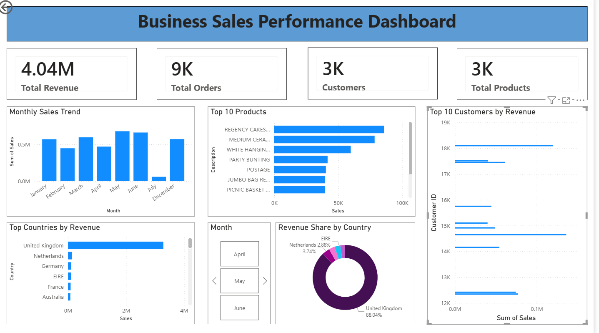

# 📊 Business Sales Performance Analytics

A comprehensive Business Sales Performance Analytics project developed using **Python**, **Power BI**, **Pandas**, **Matplotlib**, and **Jupyter Notebook** to analyze retail sales data, identify business insights, and build an interactive dashboard for decision-making.

---

## 📌 Project Overview

This project focuses on analyzing historical retail sales data to understand business performance through data cleaning, exploratory data analysis (EDA), visualization, and dashboard development.

The project demonstrates an end-to-end Data Analytics workflow, starting from raw data preprocessing to generating business insights using Power BI.

---

# 🚀 Project Objectives

- Clean and preprocess raw retail sales data.
- Perform exploratory data analysis (EDA).
- Analyze customer purchasing behavior.
- Identify top-performing products.
- Identify highest revenue-generating countries.
- Analyze monthly and daily sales trends.
- Discover top customers based on revenue.
- Build an interactive Power BI dashboard.
- Generate visual reports for business decision-making.

---

# 🛠️ Technologies Used

| Technology | Purpose |
|------------|---------|
| Python | Data Analysis |
| Pandas | Data Cleaning |
| NumPy | Numerical Operations |
| Matplotlib | Data Visualization |
| Jupyter Notebook | Analysis |
| Power BI | Dashboard Development |
| Git & GitHub | Version Control |

---

# 📂 Project Structure

```
Business-Sales-Performance-Analytics/
│
├── dashboard/
│   ├── Business_Sales_Analysis.pbix
│   ├── Business_Sales_Analysis_dashboard.pdf
│   ├── dashboard.png
│   └── README.md
│
├── data/
│   ├── raw/
│   ├── processed/
│
├── images/
│
├── notebooks/
│
├── presentation/
│
├── python/
│
├── reports/
│
└── README.md
```

---

# 📊 Dataset

Dataset Name:

**Online Retail Dataset**

Dataset contains:

- Customer Transactions
- Invoice Details
- Product Information
- Country
- Quantity
- Unit Price
- Invoice Date

---

# 🔄 Project Workflow

### Step 1
Import Dataset

↓

### Step 2
Data Cleaning

- Remove missing values
- Remove duplicate records
- Handle incorrect data types
- Remove cancelled invoices

↓

### Step 3
Feature Engineering

Created new features such as

- Revenue
- Month
- Day
- Year

↓

### Step 4
Exploratory Data Analysis

Performed analysis on

- Sales Trend
- Revenue Trend
- Country-wise Revenue
- Customer Analysis
- Product Analysis

↓

### Step 5
Visualization using Python

Created multiple business charts.

↓

### Step 6
Power BI Dashboard

Built an interactive Business Sales Dashboard.

↓

### Step 7
Business Insights

Generated key findings and recommendations.

---

# 📈 Dashboard KPIs

✔ Total Revenue

✔ Total Orders

✔ Total Customers

✔ Total Products

---

# 📊 Dashboard Visualizations

- Monthly Sales Trend
- Top Countries by Revenue
- Revenue Share by Country
- Top 10 Products
- Top 10 Customers
- Month Filter (Slicer)

---

# 📷 Dashboard Preview

> Dashboard Screenshot



---

# 📉 Python Visualizations

The project includes various visualizations created using Matplotlib.

Examples:

- Monthly Sales Trend
- Daily Sales Trend
- Top Selling Products
- Top Quantity Sold Products
- Top Customers
- Top Countries
- Revenue Distribution
- Highest Priced Products

All charts are available inside the **images/** folder.

---

# 📁 Project Files

| Folder | Description |
|---------|-------------|
| dashboard | Power BI Dashboard |
| data | Raw & Cleaned Dataset |
| images | Python Visualizations |
| notebooks | Jupyter Notebook |
| python | Source Code |
| reports | Project Report |
| presentation | PowerPoint Presentation |

---

# 📌 Key Business Insights

- United Kingdom generated the highest revenue.
- Sales reached their peak during May and June.
- A small number of products contributed significantly to total revenue.
- Top customers generated a substantial share of overall sales.
- Revenue distribution was concentrated in a few countries.

---

# 📈 Future Improvements

- Sales Forecasting using Machine Learning
- Customer Segmentation
- Profit Analysis
- Product Recommendation System
- Real-Time Dashboard
- SQL Database Integration

---

# ▶️ How to Run

Clone the repository

```bash
git clone <repository-link>
```

Install required libraries

```bash
pip install pandas numpy matplotlib jupyter
```

Open Jupyter Notebook

```bash
jupyter notebook
```

Run

```
Business_Sales_Analysis.ipynb
```

Open Power BI Dashboard

```
Business_Sales_Analysis.pbix
```

---

# 📚 Skills Demonstrated

- Data Cleaning
- Data Preprocessing
- Feature Engineering
- Exploratory Data Analysis
- Data Visualization
- Business Intelligence
- Dashboard Design
- Power BI
- Python
- GitHub Documentation

---

# 👨‍💻 Author

**Vijay Kumar A G**

M.Tech – Data Science

Presidency University, Bengaluru

---

# ⭐ If you found this project useful, consider giving it a Star.
